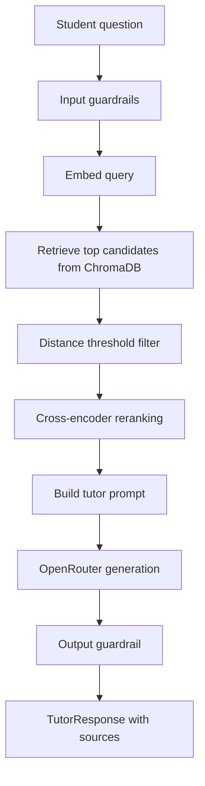

# Architecture

Poli-Tutor is split into three main areas:

- `app/backend`: application API and business logic.
- `app/frontend`: browser interface.
- `rag`: ingestion, retrieval, generation and evaluation.

The backend owns users, courses, chats, messages, reports, analytics and memory. The RAG package owns document indexing and tutor generation.

## Backend

The backend is a FastAPI application in `app/backend`.

Important folders:

| Folder | Responsibility |
| --- | --- |
| `api/` | HTTP controllers/route handlers and dependency wiring |
| `core/` | config, database connections, exceptions, logging and rate limiting |
| `schemas/` | Pydantic request/response models |
| `services/` | business logic |
| `repositories/` | MongoDB and Redis access |
| `gateways/` | external model client wrappers |
| `tests/` | unit, integration and system test support |

The backend uses dependency injection through `app/backend/api/deps.py`. Route handlers depend on service interfaces, and services depend on repository interfaces.

### API Route Groups

All application routes are mounted under:

```text
/api/v1
```

Current groups:

| Group | Purpose |
| --- | --- |
| `auth` | login, logout and password changes |
| `users` | admin user management and self account deletion |
| `courses` | course listing and admin course management |
| `chat` / `chats` | conversation creation, listing, reading and deletion |
| `messages` | student question submission and tutor answers |
| `report` | report or unreport an assistant message |
| `analytics` | teacher/admin dashboard metrics |
| `memory` | list and delete stored student memories |

The complete API documentation is generated at:

```text
http://localhost:8000/docs
```

## RAG Boundary

The backend talks to the RAG runtime through the `IRagEngine` contract in `contracts/rag/interfaces.py`.

```python
class IRagEngine(Protocol):
    def ask(
        self,
        course: str,
        query: str,
        summary: str = "",
        history: list[dict] | None = None,
        memory: str = "",
        course_scope: str = "",
    ) -> TutorResponse:
        ...

    def preload_models(self) -> None:
        ...
```

The returned model is `TutorResponse`, defined in `contracts/rag/models.py`:

```python
class TutorResponse(BaseModel):
    answer: str
    sources: list[TutorSource]
    is_fallback: bool
    is_guardrail: bool = False
    is_output_guardrail: bool = False
    is_retrieval_fallback: bool = False
```

## RAG Package

The RAG code is in `rag/src`.

| Folder | Responsibility |
| --- | --- |
| `ingestion/` | extract documents, chunk content, summarise images, create embeddings |
| `runtime/` | retrieve context, apply guardrails, rerank, generate tutor answers |
| `evaluation/` | retrieval benchmark, tutor benchmark, threshold calibration, visualisation |
| `shared/` | config, embedding helpers, vector store, models and utilities |

## Runtime Query Flow



Key files:

- `rag/src/runtime/engine.py`
- `rag/src/runtime/retrieval.py`
- `rag/src/runtime/reranker.py`
- `rag/src/runtime/generator.py`
- `rag/src/runtime/guardrails.py`

## Storage

| Store | Used for |
| --- | --- |
| MongoDB | users, courses, chats, messages, reports, memories and analytics data |
| Redis | recent conversation cache and token/session-related cache |
| ChromaDB Cloud | embedded course chunks and image summaries |
| Docker volume `huggingface_cache` | downloaded embedding and reranker models |

## Conversation And Memory

The backend stores durable conversation state in MongoDB. Redis is used for recent context cache. Long-term user memory is stored in MongoDB and can be included in the RAG prompt through the backend context service.

The RAG runtime receives:

- course code;
- current question;
- conversation summary;
- recent history;
- student memory.

It returns the tutor answer, cited sources and guardrail/fallback flags.

## Guardrails

The tutor behaviour is protected by three layers:

| Layer | Location | Purpose |
| --- | --- | --- |
| Input guardrail | `rag/src/runtime/guardrails.py` | blocks prompt injection, code requests and invalid input before retrieval/generation |
| System prompt | `rag/src/shared/config.py` | instructs the model to act as a strict Socratic tutor |
| Output guardrail | `rag/src/runtime/guardrails.py` | catches direct-answer style generations and replaces them with a redirect |

## Frontend

The frontend is a React/Vite app in `app/frontend`.

Important folders:

| Folder | Responsibility |
| --- | --- |
| `src/router/` | route definitions |
| `src/pages/` | page-level views |
| `src/components/` | reusable UI components |
| `src/api/` | HTTP API client code |
| `src/services/` | frontend service layer |
| `src/hooks/` | reusable React hooks |
| `src/test/` | test setup and Playwright system tests |

## Container Layout

`docker-compose.yml` starts:

- `redis`
- `backend`
- `frontend`

The backend container mounts:

- `./app:/app/app`
- `./rag:/app/rag`
- `huggingface_cache:/root/.cache/huggingface`

The backend reads both environment files:

- `app/backend/.env`
- `rag/.env`

`docker-compose.test.yml` is separate and starts an isolated MongoDB and Redis container for e2e tests.