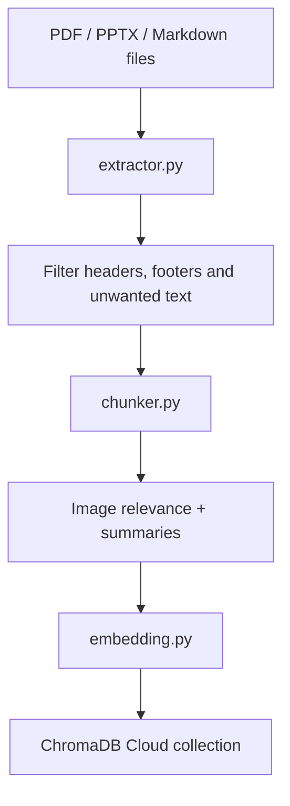

# Ingestion

Ingestion is the process that converts course files into searchable chunks in ChromaDB Cloud.

The main application stack does not run ingestion automatically. Run ingestion when:

- setting up a course for the first time;
- adding new documents;
- changing the embedding model;
- changing the target ChromaDB collection;
- regenerating the vector store after cleaning a collection.

## Pipeline Overview



The pipeline:

1. Reads files from `COURSE_PATH`.
2. Extracts text, tables and images with the Unstructured API.
3. Removes configured headers, footers and ignored keywords.
4. Groups content by page.
5. Chunks content using the strategy for each source type.
6. Summarises relevant images through OpenRouter.
7. Embeds text and image summaries.
8. Upserts chunks into ChromaDB Cloud.

## Required Environment

Create `rag/.env`:

```bash
cp rag/.env.example rag/.env
```

For ingestion, these variables are required:

```env
UNSTRUCTURED_API_KEY=your_key_here
UNSTRUCTURED_API_URL=https://api.unstructuredapp.io/general/v0/general

CHROMA_API_KEY=your_key_here
CHROMA_TENANT=your_tenant_here
CHROMA_DATABASE=your_database_here

OPENROUTER_KEY=your_key_here
```

Optional:

```env
RAW_DATA_PATH=/path/to/data/raw
COURSE_PATH=/path/to/data/raw/ED
```

Defaults:

- `RAW_DATA_PATH`: `rag/data/raw`
- `COURSE_PATH`: `rag/data/raw/ED`

## Input File Location

Place documents under:

```text
rag/data/raw/<course_code>/
```

Example:

```text
rag/data/raw/ED/
```

## File Naming Convention

Files must follow:

```text
<source_type>.<course_code>.<description>.<ext>
```

Examples:

| File | source_type | course_code |
| --- | --- | --- |
| `slides.ED.Aula01.pdf` | `slides` | `ed` |
| `apontamentos.ED.CAP1.2.pdf` | `apontamentos` | `ed` |
| `apontamentos.ED.Resumo.md` | `apontamentos` | `ed` |

Supported extensions:

```text
.pdf
.pptx
.md
```

Valid source types are defined in `CHUNKING_STRATEGIES` inside `rag/src/shared/config.py`. The current explicit strategies are:

- `slides`
- `apontamentos`

## Run Ingestion With Docker

Build the ingestion image from the `rag/` folder:

```bash
cd rag
docker build -t poli-tutor-ingestion .
```

Run the pipeline:

```bash
docker run --env-file .env poli-tutor-ingestion
```

Run with an explicit embedding model and collection:

```bash
docker run --env-file .env poli-tutor-ingestion \
  python -m src.ingestion.pipeline \
  --model BAAI/bge-m3 \
  --collection PoliTutor-Docs-bge-m3
```

If you need to mount a custom data folder:

```bash
docker run --env-file .env \
  -v /absolute/path/to/raw:/data/raw \
  -e RAW_DATA_PATH=/data/raw \
  -e COURSE_PATH=/data/raw/ED \
  poli-tutor-ingestion
```

## Run Ingestion Without Docker

From the `rag/` folder:

```bash
python3.11 -m venv venv
source venv/bin/activate

pip install -r requirements-dev.txt
python -m src.ingestion.pipeline
```

## Collections And Embedding Models

The runtime embedding model and the ingestion embedding model must match. The default model in `rag/src/shared/config.py` is:

```text
BAAI/bge-m3
```

The default Chroma collection is:

```text
PoliTutor-Docs
```

For benchmark comparisons, each embedding model should use its own collection:

```bash
python -m src.ingestion.pipeline \
  --model BAAI/bge-m3 \
  --collection PoliTutor-Docs-bge-m3

python -m src.ingestion.pipeline \
  --model intfloat/multilingual-e5-base \
  --collection PoliTutor-Docs-e5-base
```

## Re-Running Ingestion

Chunk IDs are based on the file stem and chunk index. Re-running ingestion for the same files and same collection upserts those IDs again.

Use a new collection when:

- comparing embedding models;
- changing chunking behaviour significantly;
- wanting to keep the existing collection untouched.

Clean or delete a collection in ChromaDB Cloud when:

- source files were renamed;
- a document was removed;
- chunk counts changed and old chunk IDs may remain;
- you want a fully fresh index.

## Output Artifacts

The pipeline may write extracted image artifacts under:

```text
rag/data/processed/images/
```

## Validation Checklist

Before running:

- `rag/.env` exists.
- ChromaDB Cloud credentials are valid.
- OpenRouter key is valid.
- Unstructured API key and URL are set.
- Files are under the expected `COURSE_PATH`.
- Filenames follow the required convention.

After running:

- Logs show each file as processed.
- ChromaDB Cloud contains the target collection.
- The backend uses the same collection and embedding model expected by runtime config.
